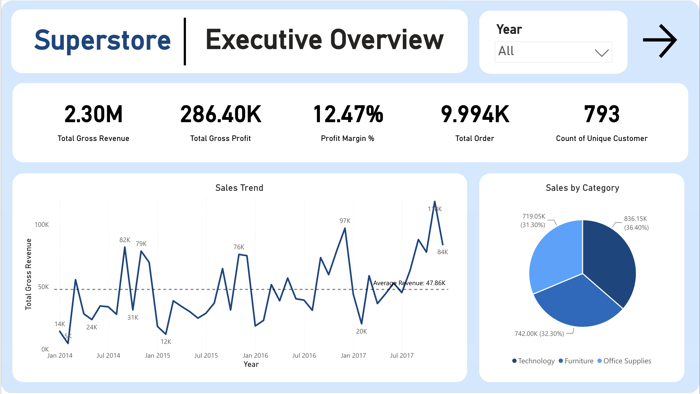
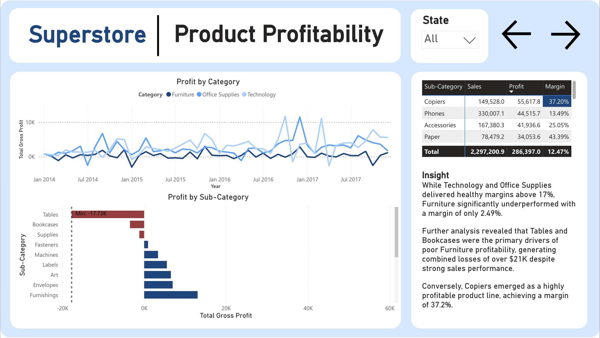
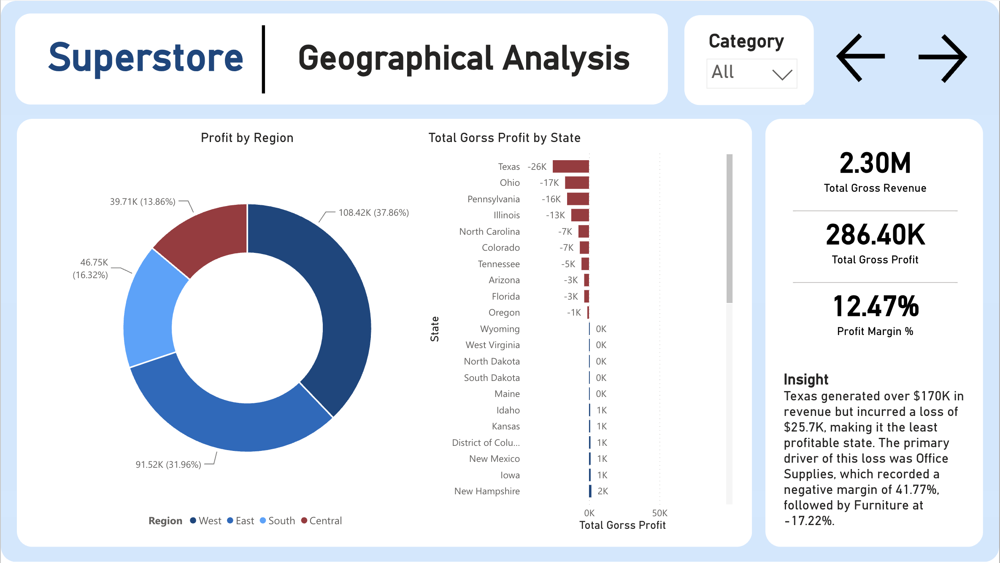
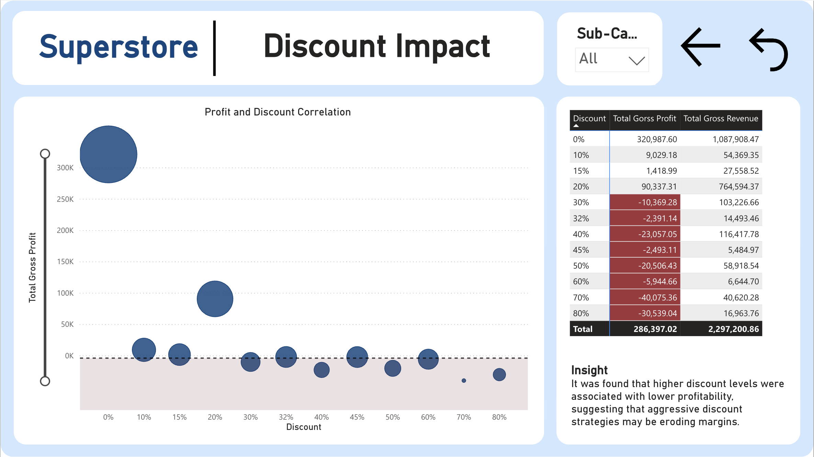

# Sales Performance Analysis
### Superstore | SQL | Power BI | DAX | Excel | Python

## 1. Overview
Analyzed Superstore sales data to evaluate overall sales performance, uncover loss-making product lines and regions, and assess how discounting impacted profitability.

## 2. Business Problem
Although the business was generating solid sales, profitability was uneven across product categories and regions.  
The key stakeholder questions were:

- Which product categories and sub-categories are driving profit, and which are hurting performance?
- Which regions and states are underperforming despite generating strong sales?
- Is discounting helping the business grow sales efficiently, or is it eroding margins?
- What actions should the business take to improve profitability without sacrificing revenue?

---

## 3. Tools & Process

## SQL
The SQL layer of this project was used to answer the core business questions behind the dashboard:

- Cleaned and validated the Superstore dataset
- Built KPI summaries for sales, profit, orders, and customers
- Analyzed sales and profit by category, sub-category, region, and state
- Calculated profit margin across product groups and geographies
- Investigated the relationship between discount levels and profitability
- Performed root-cause analysis on underperforming markets such as Texas

### Python
- Used for basic data inspection before analysis, including checking table structure, row counts, missing values, duplicates, and summary statistics

### Power BI
- Built a 4-page dashboard to present executive performance, product profitability, geographic performance, and discount impact
- Designed visuals to move from high-level KPI monitoring into root-cause analysis
- Used KPI cards, trend charts, sub-category profitability views, regional breakdowns, and discount analysis visuals to support business recommendations

---

## 4. Key Findings

- The business generated **$2.30M in revenue** and **$286.4K in profit** from **9,994 order lines** across **793 unique customers**.
- **Technology** was the strongest-performing category, delivering both the **highest revenue** and **highest profit**.
- **Furniture** significantly underperformed, generating a profit margin of only **2.49%**, far below the healthier margins seen in **Technology** and **Office Supplies**.
- Within Furniture, **Tables** and **Bookcases** were the primary drivers of poor profitability, generating **more than $21K in combined losses** despite strong sales performance.
- **Copiers** stood out as one of the most profitable product lines, achieving a **37.2% profit margin**.
- Geographically, the **West** region generated the **highest revenue**, while the **Central** region had the weakest profitability overall.
- At the state level, **Texas** generated over **$170K in revenue** but still recorded a **-$25.7K loss**, making it the least profitable state in the dataset.
- In Texas, the largest profitability issue came from **Office Supplies**, which recorded a **-41.77% margin**, followed by **Furniture** at **-17.22%**.
- Discount analysis suggested that **higher discount levels were associated with weaker profitability**, indicating that aggressive discounting may be eroding margins rather than driving healthy growth.

---

## 5. Dashboard Preview

### Interactive Dashboard

Explore the live Power BI dashboard here:

[Open Interactive Power BI Dashboard](https://app.powerbi.com/reportEmbed?reportId=54954f21-4362-442b-866b-901f415fb7f9&autoAuth=true&ctid=fe3fbfc3-740c-40d3-a502-14423e1ca052&actionBarEnabled=true)

### 1) Dashboard Overview


### 2) Product Profitability


### 3) Geographical Analysis


### 4) Discount Impact


---

## 6. Recommendations

### 1) Review Furniture pricing and discount strategy
Furniture generated meaningful sales but delivered weak profitability. The business should review pricing, discount levels, and margin structure for **Tables** and **Bookcases**, which were the main drivers of category losses.

### 2) Tighten discounting on low-margin products
Since higher discount levels were associated with weaker profitability, discount policies should be reviewed—especially for already low-margin products. Discounts should be applied selectively and evaluated based on profit impact, not just revenue lift.

### 3) Investigate Texas as a priority turnaround market
Texas generated strong revenue but substantial losses, suggesting a profitability problem rather than a demand problem. The business should review:
- category mix sold in Texas
- discounting patterns by product group
- whether low-margin Office Supplies are being over-promoted
- operational or pricing issues specific to the state

### 4) Double down on high-performing product lines
The company should continue investing in profitable categories and sub-categories such as **Technology** and **Copiers**, which demonstrated strong profit contribution and healthy margins.

### 5) Monitor margin alongside revenue
Strong sales alone can hide underperforming categories and markets. Management should track **revenue, profit, and margin together** by category, sub-category, region, and state to avoid scaling unprofitable segments.

---

## 7. Project Structure

```text
sales-performance-analysis/
│
├─ README.md
├─ sql/
│  ├─ kpi_summary.sql
│  ├─ sales_by_category.sql
│  ├─ profit_by_category.sql
│  ├─ profit_by_subcategory.sql
│  ├─ sales_by_region.sql
│  ├─ profit_by_region.sql
│  ├─ profit_by_state.sql
│  ├─ profit_margin_analysis.sql
│  ├─ dsicount_impact.sql
│  └─ texas_root_cause_analysis.sql
│
├─ powerbi/
│  └─ sales_performance_dashboard.pbix
│
├─ assets/
│  ├─ dashboard-overview.png
│  ├─ product-profitability.png
│  ├─ geographical-analysis.png
│  └─ discount-impact.png
│
└─ docs/
   └─ business_questions.md
```

---

## 8. Skills Demonstrated
- Sales and profitability analysis
- Product performance analysis
- Regional and state-level performance analysis
- Discount impact analysis
- SQL aggregation and business KPI analysis
- Python basic data inspection
- Power BI dashboard storytelling
- Turning data insights into business recommendations
